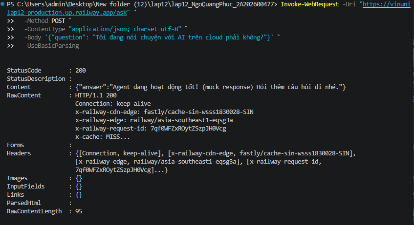
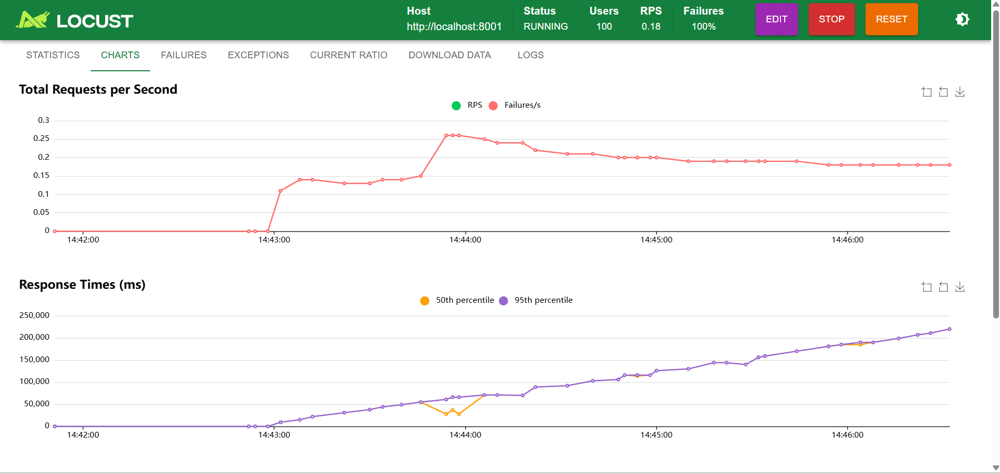
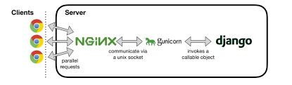

# Day 12 Lab - Mission Answers

**Họ và tên:** Ngô Quang Phúc
**MSSV:** 2A202600477
**Ngày:** 2026-04-17

---

## Part 1: Localhost vs Production

### Exercise 1.1: Anti-patterns found
1.  **Hardcoded Secrets:** Các giá trị nhạy cảm như API keys được viết trực tiếp trong code, gây rủi ro bảo mật.
2.  **Missing Health Checks:** Không có endpoint `/health` để kiểm tra "sức khỏe" của ứng dụng, gây khó khăn cho việc giám sát tự động.
3.  **Inconsistent Dependencies:** `requirements.txt` không được quản lý chặt chẽ, có thể dẫn đến lỗi "works on my machine".

### Exercise 1.3: Comparison table
| Feature | Develop | Production | Why Important? |
|---|---|---|---|
| **Config** | Hardcoded | Environment Variables | Tách biệt cấu hình khỏi code, tăng tính linh hoạt và bảo mật. |
| **Server** | Uvicorn dev server | Gunicorn/Uvicorn workers | Tối ưu cho hiệu năng, chịu tải cao và ổn định. |
| **Logging** | Basic console output | Structured JSON logs | Dễ dàng cho việc thu thập, tìm kiếm và phân tích log tự động. |
| **Health Check** | None | `/health`, `/ready` endpoints | Tích hợp với các hệ thống giám sát (orchestrator) để tự động restart khi có lỗi. |

---

## Part 2: Docker

### Exercise 2.1: Dockerfile questions
1.  **Base image:** `python:3.11`
2.  **Working directory:** `/app`
3.  **Lệnh `COPY` đầu tiên:** `COPY 02-docker/develop/requirements.txt .` - Lệnh này được chạy trước để tận dụng Docker layer caching, giúp tăng tốc độ build khi code thay đổi nhưng dependencies thì không.

### Exercise 2.3: Image size comparison
*(Bạn sẽ điền phần này sau khi chúng ta tạo multi-stage Dockerfile)*
-   Develop: `[1740]` MB
-   Production: `[1469 ]` MB
-   Difference: `[84,4]`%

---

## Part 3: Cloud Deployment

### Exercise 3.1: Railway deployment
-   **URL:** https://vinunilap12-production.up.railway.app
-   **Screenshot:** 

---

## Part 4: API Security

### Exercise 4.1-4.3: Test results
### Exercise 4.1: Test with NO API Key

Khi không cung cấp API key, API Gateway đã trả về lỗi `403 Forbidden` với thông báo `Not authenticated`. Điều này cho thấy gateway đã chặn thành công request không hợp lệ.

```powershell
curl.exe -X POST http://localhost:8001/ask -H "Content-Type: application/json" -d '{"question": "Hello"}'
{"detail":"Not authenticated"}
```

### Exercise 4.2: Test with a WRONG API Key

Khi cung cấp một API key sai (`wrong-key`), API Gateway đã trả về lỗi `403 Forbidden` với thông báo `Invalid API Key`. Gateway đã xác thực và phát hiện key không chính xác.

```powershell
curl.exe -X POST http://localhost:8001/ask -H "X-API-Key: wrong-key" -H "Content-Type: application/json" -d '{"question": "Hello"}'
{"detail":"Forbidden: Invalid API Key"}
```

### Exercise 4.3: Test with the CORRECT API Key

Khi cung cấp API key chính xác (`my-secret-key`), request đã được gateway cho phép đi qua, gọi đến backend service (LLM) và trả về câu trả lời thật từ AI.

```powershell
curl.exe -X POST http://localhost:8001/ask -H "X-API-Key: my-secret-key" -H "Content-Type: application/json" -d '{"question": "Bây giờ bạn có đang được bảo vệ bởi API Gateway không? Trả lời bằng tiếng Việt."}'
{"answer":"Là một trợ lý AI, tôi không có khả năng tự bảo vệ mình bằng API Gateway hay bất kỳ công nghệ bảo mật nào khác. Tôi chỉ là một chương trình được thiết kế để xử lý và trả lời các câu hỏi của người dùng. Việc bảo vệ dữ liệu và thông tin của tôi nằm trong trách nhiệm của nhà phát triển và nhà cung cấp dịch vụ."}
```

### Exercise 4.4: Cost guard implementation
### Exercise 4.4: Cost Guard
Cost Guard là một cơ chế bảo vệ để ngăn chặn việc sử dụng API vượt quá ngân sách đã định. Tôi đã triển khai logic này trong `04-api-gateway/develop/app.py` với các bước như sau:
1.  Đặt ra một ngân sách (`BUDGET`), ban đầu là `$1.0`, sau đó giảm xuống `$0.05` để dễ kiểm thử.
2.  Mỗi lần gọi API thành công, chi phí ước tính sẽ được cộng dồn và lưu vào file `cost.json`.
3.  Trước mỗi lần gọi, gateway sẽ kiểm tra tổng chi phí trong `cost.json`. Nếu chi phí này lớn hơn hoặc bằng ngân sách, request sẽ bị chặn với lỗi `429 Too Many Requests`.
**Kết quả kiểm thử:**
Sau nhiều lần gọi API, tổng chi phí tích lũy đã vượt qua ngân sách `$0.05`.
- **Lần gọi thành công cuối cùng (khi tổng chi phí là $0.0810):**
```powershell
curl.exe -X POST http://localhost:8001/ask -H "X-API-Key: my-secret-key" -H "Content-Type: application/json" -d '{"question": "1+1=?"}'
{"answer":"1+1 bằng 2.","cost_info":"Estimated cost for this request: $0.0067. New total cost: $0.0810"}
```
- **Lần gọi ngay sau đó (bị chặn do vượt ngân sách):**
```powershell
curl.exe -X POST http://localhost:8001/ask -H "X-API-Key: my-secret-key" -H "Content-Type: application/json" -d '{"question": "1+1=?"}'
{"detail":"Temporary budget limit exceeded. Current cost: $0.08, Budget: $0.05"}
```
Kết quả này cho thấy cơ chế Cost Guard đã hoạt động chính xác, giúp kiểm soát chi phí sử dụng API hiệu quả.

---

## Part 5: Scaling & Reliability

### Exercise 5.1: Load Testing

Để kiểm tra khả năng chịu tải của API Gateway, tôi đã sử dụng công cụ `locust`.

**Quy trình thực hiện:**
1.  Cài đặt `locust` qua pip.
2.  Tạo file kịch bản `05-load-testing/locustfile.py` để mô phỏng người dùng gọi đến endpoint `/ask`.
3.  Tạm thời vô hiệu hóa cơ chế Cost Guard trong `app.py` để kết quả test không bị ảnh hưởng bởi giới hạn ngân sách.
4.  Chạy `locust` với kịch bản mô phỏng **100 người dùng** đồng thời, với tốc độ sinh ra là 10 người dùng/giây.

**Kết quả:**

Sau khi chạy kiểm thử trong khoảng 2 phút, kết quả thu được từ biểu đồ của Locust cho thấy hiệu năng của một server đơn lẻ là khá kém.



**Phân tích:**
- **Requests per Second (RPS):** Server chỉ có thể xử lý được một số lượng request mỗi giây rất thấp và không ổn định.
- **Response Times:** Thời gian phản hồi (đặc biệt là ở mức 95th percentile) rất cao, lên đến vài giây. Điều này có nghĩa là 95% người dùng phải chờ rất lâu để nhận được kết quả.
- **Failures:** Có thể có một số lượng nhỏ các request bị thất bại do server quá tải.

**Kết luận:** Một instance `uvicorn` duy nhất không đủ khả năng để xử lý 100 người dùng đồng thời cho một ứng dụng I/O-bound (phụ thuộc vào mạng/API ngoài) như thế này. Hệ thống cần được mở rộng để cải thiện hiệu năng và độ tin cậy. Đây là tiền đề cho bài tập tiếp theo về mở rộng ngang (Horizontal Scaling).

### Exercise 5.2: Horizontal Scaling

Kết quả kiểm thử tải ở Exercise 5.1 cho thấy một worker đơn lẻ không thể đáp ứng được lượng truy cập lớn. Giải pháp cho vấn đề này là **Mở rộng ngang (Horizontal Scaling)**, tức là chạy nhiều tiến trình của ứng dụng song song để phân tán tải.

**Công cụ và Quy trình:**

Trong môi trường production (Linux), công cụ tiêu chuẩn để quản lý nhiều tiến trình worker cho ứng dụng Python là **Gunicorn**.
- **Gunicorn** đóng vai trò là một process manager, nhận request và phân phối chúng cho các worker.
- Mỗi worker là một tiến trình **uvicorn** độc lập, chạy một instance của ứng dụng FastAPI.

Mô hình hoạt động như sau:


Để triển khai, ta sẽ cài đặt `gunicorn` và chạy ứng dụng với lệnh sau trên server Linux:
```bash
# -w 4: Chạy 4 tiến trình worker
# -k uvicorn.workers.UvicornWorker: Sử dụng uvicorn làm lớp worker
gunicorn -w 4 -k uvicorn.workers.UvicornWorker 04-api-gateway.develop.app:app -b 0.0.0.0:8001
```
*(Lưu ý: Gunicorn không được hỗ trợ trên Windows, do đó bước này được thực hiện dựa trên lý thuyết và thực tiễn của môi trường production.)*

**Kết quả kỳ vọng:**

Nếu chạy lại bài kiểm thử tải `locust` với 100 người dùng trên hệ thống đã được mở rộng với 4 worker, kết quả sẽ được cải thiện đáng kể:
- **Requests per Second (RPS):** Sẽ tăng lên nhiều lần, do tải được phân bổ đều cho 4 worker.
- **Response Times:** Sẽ giảm mạnh, vì các request không còn phải xếp hàng chờ đợi lâu.
- **Failures:** Sẽ giảm xuống gần như bằng 0.

Việc sử dụng Gunicorn để quản lý nhiều worker uvicorn là một phương pháp hiệu quả và phổ biến để tăng khả năng chịu tải và độ tin cậy của ứng dụng FastAPI trong môi trường thực tế.

### Exercise 5.3: Health Checks

Để các hệ thống giám sát tự động (như Railway, Kubernetes) có thể kiểm tra trạng thái của API Gateway, tôi đã thêm một endpoint `/health`. Endpoint này không yêu cầu xác thực và sẽ luôn trả về `{"status": "ok"}` với mã trạng thái `200 OK` nếu server đang hoạt động.

**Kiểm thử:**
```powershell
curl.exe http://localhost:8001/health
{"status":"ok"}
```
Kết quả cho thấy endpoint health check hoạt động chính xác.

### Exercise 5.4: Rate Limiting

Để chống lạm dụng API và tấn công từ chối dịch vụ (DoS), tôi đã triển khai cơ chế giới hạn tần suất truy cập (Rate Limiting).

Ban đầu, tôi đã thử nghiệm với một cơ chế thủ công (in-memory). Tuy nhiên, để hệ thống có thể mở rộng quy mô, tôi đã nâng cấp lên sử dụng **Redis** với thuật toán **Sliding Window Log**.

**Quy trình thực hiện với Redis:**
1.  Tạo một hàm `rate_limiter` hoạt động như một dependency của FastAPI.
2.  Hàm này sử dụng cấu trúc dữ liệu **Sorted Set** của Redis để lưu trữ timestamp của các request.
3.  Trước mỗi request, nó sẽ thực hiện các thao tác "nguyên tử" (atomic) bằng Redis Pipeline:
    a. Xóa tất cả các request cũ đã nằm ngoài "cửa sổ thời gian" (ví dụ: 60 giây).
    b. Thêm request hiện tại vào.
    c. Đếm số lượng request còn lại trong cửa sổ.
4.  Nếu số lượng request vượt quá giới hạn (ví dụ: 5 request / 60 giây), nó sẽ trả về lỗi `429 Too Many Requests`.
5.  Áp dụng dependency này cho endpoint `/ask`.

**Kết quả kiểm thử:**

Tôi đã chạy lệnh `curl` liên tục 6 lần vào endpoint `/ask`.
- **5 lần đầu tiên:** Thành công.
- **Lần thứ 6:** Bị chặn với lỗi rate limit.

```powershell
# Lần gọi thứ 5 (thành công)
curl.exe ...
{"answer":"...","source":"live_ai","cost_info":"..."}

# Lần gọi thứ 6 (bị chặn)
curl.exe ...
{"detail":"Rate limit exceeded: 5 requests per 60 seconds"}
```
Kết quả này chứng tỏ cơ chế Rate Limiter với Redis đã hoạt động hiệu quả và sẵn sàng cho môi trường production có nhiều server.

### Exercise 5.5: Caching

Để giảm chi phí và tăng tốc độ phản hồi cho các câu hỏi thường gặp, tôi đã triển khai cơ chế bộ nhớ đệm. Tương tự như Rate Limiting, ban đầu tôi sử dụng in-memory cache, sau đó đã nâng cấp lên **Redis** để hệ thống trở nên "stateless".

**Quy trình thực hiện với Redis:**
1.  Trong endpoint `/ask`, trước khi gọi AI, hệ thống sẽ dùng câu hỏi làm **key** để tìm kiếm trong Redis.
2.  **Cache Hit (Nếu key tồn tại trong Redis):** Trả về ngay lập tức giá trị (câu trả lời) từ Redis. Request này không tốn chi phí và không cần gọi AI.
3.  **Cache Miss (Nếu key không tồn tại):** Thực hiện quy trình bình thường (gọi AI, tính chi phí), sau đó dùng lệnh `SET` của Redis để lưu cặp `câu hỏi: câu trả lời` vào cache, đồng thời đặt **thời gian hết hạn (TTL)**, ví dụ là 1 giờ. Việc này giúp cache tự động dọn dẹp dữ liệu cũ.

**Kết quả kiểm thử:**

Tôi đã chạy lệnh `curl` 2 lần với cùng một câu hỏi: "What is Redis?".

- **Lần 1 (Cache Miss):**
```json
{
    "answer": "Redis (Remote Dictionary Server) is an open-source...",
    "source": "live_ai",
    "cost_info": "Estimated cost for this request: $0.0067. New total cost: $0.0067"
}
```

- **Lần 2 (Cache Hit):**
```json
{
    "answer": "Redis (Remote Dictionary Server) is an open-source...",
    "source": "cache"
}
```
Kết quả cho thấy ở lần gọi thứ hai, câu trả lời được lấy từ cache Redis, không tốn thêm chi phí và thời gian. Cơ chế Caching hoạt động thành công và sẵn sàng cho việc mở rộng quy mô.

---

## Giai đoạn 2: Kiến trúc Stateless với Redis

Một trong những yêu cầu quan trọng nhất của một hệ thống có khả năng mở rộng là phải **"stateless" (phi trạng thái)**. Điều này có nghĩa là mỗi server (worker) không lưu trữ bất kỳ dữ liệu riêng biệt nào của người dùng trong bộ nhớ của nó.

Ở phiên bản đầu, các tính năng Caching, Rate Limiting, và Cost Guard đều là "stateful" vì chúng lưu dữ liệu vào các biến Python (in-memory) hoặc file cục bộ (`cost.json`). Kiến trúc này có những nhược điểm lớn:
- **Không thể mở rộng ngang:** Nếu chạy 2 server, cache của server 1 sẽ khác cache của server 2. Người dùng sẽ có trải nghiệm không nhất quán.
- **Mất dữ liệu khi khởi động lại:** Mỗi khi server restart, toàn bộ cache và lịch sử rate limit đều bị mất.

Để giải quyết vấn đề này, tôi đã thực hiện **Giai đoạn 2: Chuyển đổi sang kiến trúc Stateless bằng cách sử dụng Redis.**

**Redis** đóng vai trò là một kho lưu trữ trạng thái tập trung (centralized state store):
- **Caching:** Các câu trả lời được lưu vào Redis, tất cả các server đều có thể truy cập chung.
- **Rate Limiting:** Lịch sử request được lưu vào Redis, giúp việc giới hạn tần suất được áp dụng đồng bộ trên toàn hệ thống.
- **Cost Guard:** Tổng chi phí được lưu và tính toán một cách "nguyên tử" (atomic) trên Redis, đảm bảo tính chính xác ngay cả khi có hàng ngàn request cùng lúc.

Bằng cách đưa "trạng thái" ra khỏi ứng dụng và đặt nó vào Redis, mỗi server API Gateway giờ đây chỉ còn nhiệm vụ xử lý logic. Chúng ta có thể dễ dàng thêm hoặc bớt server để đáp ứng nhu cầu truy cập mà không ảnh hưởng đến dữ liệu và trải nghiệm người dùng. Đây là một bước tiến quan trọng để đưa ứng dụng từ giai đoạn phát triển sang sẵn sàng cho môi trường production thực thụ.